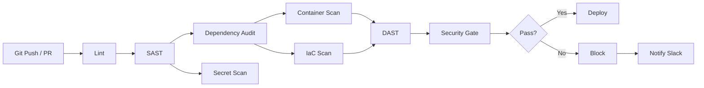

# Kirov DevSecOps Suite

[](https://github.com/kirov/kirov-devsecops-suite/actions)
[](https://github.com/kirov/kirov-devsecops-suite/actions)
[](https://github.com/kirov/kirov-devsecops-suite)
[](https://github.com/kirov/kirov-devsecops-suite)
[](https://github.com/kirov/kirov-devsecops-suite)
[](https://github.com/kirov/kirov-devsecops-suite)
[](https://github.com/kirov/kirov-devsecops-suite)
[](https://github.com/kirov/kirov-devsecops-suite)
[](https://www.cisecurity.org/benchmark)
[](LICENSE)

**Shift-left security scanning across the entire software delivery lifecycle.** The Kirov DevSecOps Suite provides automated security gates for CI/CD pipelines, container security, infrastructure-as-code compliance, dependency auditing, and secret detection — integrated across 14 Kirov microservice repositories.

---

## Architecture

```
┌─────────────────────────────────────────────────────────────────────────┐
│                         Kirov DevSecOps Suite                           │
├─────────────────────────────────────────────────────────────────────────┤
│                                                                         │
│  ┌─────────────┐  ┌────────────┐  ┌──────────────┐  ┌───────────────┐  │
│  │   Pre-commit │  │  Security  │  │    Docker    │  │  Guardrails   │  │
│  │    Hooks     │  │  Pipeline  │  │   Security   │  │  Policy-as-   │  │
│  │  (gitleaks,  │  │ (SAST,IaC, │  │   Pipeline   │  │    Code      │  │
│  │   secrets,   │  │  secrets,  │  │  (hadolint,  │  │  (dep block,  │  │
│  │   branch     │──┤   deps,    ├──┤  trivy,      ├──┤  port rules, │  │
│  │   naming)    │  │   DAST,    │  │  dive,       │  │  priv esc,   │  │
│  │              │  │   gate)    │  │  syft)       │  │  rootfs)     │  │
│  └─────────────┘  └─────┬──────┘  └──────┬───────┘  └──────┬────────┘  │
│                         │                │                  │           │
│                    ┌────▼────────────────▼──────────────────▼──────┐    │
│                    │            Scanner Scripts                    │    │
│                    │  ┌────────────┐ ┌──────────┐ ┌────────────┐  │    │
│                    │  │ container_ │ │ iac_     │ │dependency_ │  │    │
│                    │  │ scanner.py │ │scanner.py│ │auditor.py  │  │    │
│                    │  └────────────┘ └──────────┘ └────────────┘  │    │
│                    │         │              │             │       │    │
│                    │         ▼              ▼             ▼       │    │
│                    │    SARIF/JSON    CIS Report    SPDX SBOM     │    │
│                    └──────────────────────────────────────────────┘    │
│                                                                         │
│  ┌─────────────────────────────────────────────────────────────────┐   │
│  │                     Dashboard (index.html)                      │   │
│  │  Pipeline health | Vulnerability trends | Compliance score      │   │
│  └─────────────────────────────────────────────────────────────────┘   │
└─────────────────────────────────────────────────────────────────────────┘
```

## Pipeline Stages



| Stage | Tools | Description |
|-------|-------|-------------|
| **Lint** | flake8, eslint | Static code analysis and style enforcement |
| **SAST** | Bandit, Semgrep | Static application security testing |
| **Dependency Audit** | pip-audit, npm audit, govulncheck | Vulnerability scanning in OSS dependencies |
| **Container Scan** | Trivy, Grype | Container image vulnerability analysis |
| **IaC Scan** | Checkov, tfsec | Infrastructure-as-Code compliance scanning |
| **Secret Scan** | Gitleaks, TruffleHog | Hardcoded secret detection |
| **DAST** | OWASP ZAP | Dynamic application security testing (weekly) |
| **Security Gate** | Custom evaluator | Policy enforcement and compliance scoring |

## Quick Start

### Prerequisites

- Python 3.10+
- Docker
- Go (for govulncheck)

### Installation

```bash
# Clone the suite
git clone https://github.com/kirov/kirov-devsecops-suite.git
cd kirov-devsecops-suite

# Run container scanner
python scanners/container_scanner.py alpine:latest --output-dir results/

# Run IaC scanner
python scanners/iac_scanner.py /path/to/terraform --output-dir results/

# Run dependency auditor
python scanners/dependency_auditor.py /path/to/project --output-dir results/
```

### GitHub Actions Setup

1. Copy the pipeline files to your repository:
   ```bash
   cp kirov-devsecops-suite/pipelines/*.yml .github/workflows/
   ```

2. Set repository secrets:
   - `SLACK_WEBHOOK_URL` - for pipeline notifications
   - `DAST_TARGET_URL` - target URL for ZAP scans

3. Push to trigger the pipeline:
   ```bash
   git add .github/workflows/
   git commit -m "ci: add Kirov DevSecOps security pipeline"
   git push
   ```

### Pre-commit Hooks

```bash
# Install pre-commit
pip install pre-commit

# Install hooks from config
pre-commit install --config hooks/pre-commit-config.yaml

# Run all hooks on all files
pre-commit run --all-files --config hooks/pre-commit-config.yaml
```

## Repository Integration Guide

The Kirov DevSecOps Suite is designed to integrate across all 14 Kirov repositories. Below is the integration status and configuration for each:

### Repository Configurations

| # | Repository | Type | Pipeline | Docker Security | Notes |
|---|-----------|------|----------|----------------|-------|
| 1 | **kirov-auth-service** | Python/Flask | `security-pipeline.yml` | `docker-security.yml` | OAuth2/JWT authentication service |
| 2 | **kirov-api-gateway** | Go/Chi | `security-pipeline.yml` | `docker-security.yml` | API gateway with rate limiting |
| 3 | **kirov-user-service** | Python/FastAPI | `security-pipeline.yml` | `docker-security.yml` | User management CRUD service |
| 4 | **kirov-payment-service** | Go/Gin | `security-pipeline.yml` | `docker-security.yml` | Stripe/PayPal payment processing |
| 5 | **kirov-notification-svc** | Node/Express | `security-pipeline.yml` | `docker-security.yml` | Email/SMS/push notification service |
| 6 | **kirov-analytics-engine** | Python | `security-pipeline.yml` | `docker-security.yml` | Data analytics and reporting |
| 7 | **kirov-iac-terraform** | Terraform | `security-pipeline.yml` (IaC) | N/A | AWS/GCP infrastructure definitions |
| 8 | **kirov-helm-charts** | Kubernetes/Helm | `security-pipeline.yml` (IaC) | N/A | Helm chart repository |
| 9 | **kirov-frontend-web** | React/TypeScript | `security-pipeline.yml` | `docker-security.yml` | Web frontend application |
| 10 | **kirov-mobile-api** | Node/GraphQL | `security-pipeline.yml` | `docker-security.yml` | Mobile backend API |
| 11 | **kirov-cache-service** | Go | `security-pipeline.yml` | `docker-security.yml` | Redis-based caching layer |
| 12 | **kirov-queue-processor** | Python/Celery | `security-pipeline.yml` | `docker-security.yml` | Async task queue processor |
| 13 | **kirov-database-migrations** | Python/SQLAlchemy | `security-pipeline.yml` | N/A | Schema migration tooling |
| 14 | **kirov-cli-tool** | Go | `security-pipeline.yml` | N/A | Command-line admin tool |

### Per-Repository Setup

For each repository, create `.github/workflows/security.yml`:

```yaml
name: Security

on:
  push:
    branches: [main, develop]
  pull_request:
    branches: [main]

jobs:
  security:
    uses: kirov/kirov-devsecops-suite/.github/workflows/security-pipeline.yml@main
    secrets: inherit
    with:
      dast-target: ${{ vars.DAST_TARGET_URL || '' }}
```

For Docker-based repositories, also create `.github/workflows/docker-security.yml`:

```yaml
name: Docker Security

on:
  push:
    paths: ['Dockerfile', 'docker-compose*']

jobs:
  docker-security:
    uses: kirov/kirov-devsecops-suite/.github/workflows/docker-security.yml@main
    secrets: inherit
```

## Scanners

### Container Scanner (`scanners/container_scanner.py`)

Pulls Docker images, runs Trivy and Grype scans, and generates SARIF output for GitHub Security tab.

```bash
python scanners/container_scanner.py node:20-alpine \
  --severity HIGH,CRITICAL \
  --output-dir scan-results/ \
  --scanner both
```

**Arguments:**
| Flag | Default | Description |
|------|---------|-------------|
| `image` | required | Docker image to scan |
| `--severity` | `HIGH,CRITICAL` | Severity threshold |
| `--output-dir` | `scan-results` | Output directory |
| `--skip-pull` | `false` | Skip docker pull |
| `--scanner` | `both` | `trivy`, `grype`, or `both` |

### IaC Scanner (`scanners/iac_scanner.py`)

Scans Terraform, CloudFormation, and Kubernetes manifests with CIS benchmark compliance reporting.

```bash
python scanners/iac_scanner.py ./terraform \
  --frameworks terraform kubernetes \
  --output-dir iac-results/ \
  --format all
```

**Arguments:**
| Flag | Default | Description |
|------|---------|-------------|
| `path` | `.` | Path to scan |
| `--frameworks` | all | IaC frameworks to scan |
| `--output-dir` | `iac-results` | Output directory |
| `--format` | `all` | `json`, `csv`, `html`, `all` |
| `--skip-tfsec` | `false` | Skip tfsec scan |

### Dependency Auditor (`scanners/dependency_auditor.py`)

Scans `requirements.txt`, `Pipfile`, `package.json`, `go.mod` against OSV.dev and generates SPDX SBOM.

```bash
python scanners/dependency_auditor.py ./my-project \
  --output-dir dep-results/ \
  --format all \
  --severity-threshold MEDIUM
```

**Arguments:**
| Flag | Default | Description |
|------|---------|-------------|
| `path` | `.` | Path to scan |
| `--output-dir` | `dep-results` | Output directory |
| `--format` | `all` | `json`, `csv`, `spdx`, `all` |
| `--skip-audit` | `false` | Skip vulnerability audit |
| `--severity-threshold` | `HIGH` | Min severity to report |

## Guardrails (Policy-as-Code)

`guardrails/rules.yaml` defines enforceable security policies:

### Policy Categories

| Policy | Action | Description |
|--------|--------|-------------|
| **Dependency Blocklist** | BLOCK | Blocks known-malicious package versions (Log4Shell, etc.) |
| **Allowed Base Images** | BLOCK | Only approved base images (distroless, alpine-slim, ubi-minimal) |
| **Port Exposure** | WARN/BLOCK | Restricts which ports may be exposed (no SSH/RDP) |
| **Privilege Escalation** | BLOCK | Blocks privileged containers and root execution |
| **Read-Only RootFS** | BLOCK | Requires read-only root filesystem for containers |
| **Network Security** | WARN | Restricts host network, host ports, missing network policies |
| **Secrets Management** | BLOCK | Blocks hardcoded secrets, keys, and credentials |
| **Resource Limits** | WARN | Requires CPU/memory limits on all containers |

### Enforcement Levels

- **BLOCK**: Pipeline fails immediately when violated
- **WARN**: Pipeline continues but alerts are generated in logs and Slack notifications

## Dashboard

Open `dashboard/index.html` in any browser:

```
┌────────────────────────────────────────────────────────────┐
│  Kirov DevSecOps Dashboard                                │
├────────────────────────────────────────────────────────────┤
│  Total Scans: 142  │  Vulns: 23  │  Compliance: 87%      │
├────────────────────────────────────────────────────────────┤
│  Pipeline Health                    Compliance Score       │
│  ┌────────────────────┐            ┌────────────────────┐ │
│  │ Lint          PASS │            │     ████████░░░    │ │
│  │ SAST          PASS │            │       87%          │ │
│  │ Dependencies  3 🔴 │            └────────────────────┘ │
│  │ Container     5 ⚠️ │                                   │
│  │ IaC           PASS │  Vulnerability Trends Bar Chart   │
│  │ Secrets       CLEAN│  ██████████░░░░░░░░░░            │
│  │ DAST      SCHEDULED│  Week 1 2 3 4 5 6 7 8           │
│  │ Gate         PASSED│                                   │
│  └────────────────────┘  14 Repos Integrated              │
└────────────────────────────────────────────────────────────┘
```

## CIS Benchmark Alignment

The IaC scanner maps Checkov/tfsec rules to CIS Benchmarks:

- **CIS AWS Foundations v1.5**: 28 identity, logging, networking, and storage checks
- **CIS Kubernetes v1.8**: 12 pod security, RBAC, and admission control checks

Compliance reports include score, per-category breakdown, and remediation guidance.

## Output Artifacts

| Artifact | Format | Description |
|----------|--------|-------------|
| Container scan SARIF | `.sarif` | GitHub Security Tab compatible |
| Container scan report | `.json` | Structured vulnerability summary |
| IaC compliance report | `.json` | Full CIS benchmark report |
| IaC findings CSV | `.csv` | Filterable findings list |
| IaC compliance HTML | `.html` | Human-readable compliance scorecard |
| Dependency audit report | `.json` | Full dependency tree with vulns |
| Dependency audit CSV | `.csv` | Vulnerability list |
| SPDX SBOM | `.json` | SPDX 2.3 bill of materials |
| Pipeline notifications | Slack | Real-time security alerts |

## Contributing

1. Fork the repository
2. Create a feature branch (`git checkout -b feature/security-enhancement`)
3. Run pre-commit hooks (`pre-commit run --all-files`)
4. Commit changes (`git commit -m "feat: add new scanner module"`)
5. Push to branch (`git push origin feature/security-enhancement`)
6. Open a Pull Request

All contributions must pass the security pipeline gate.

## License

MIT License - see [LICENSE](LICENSE) for details.

## Security

Report vulnerabilities to security@kirov.dev. Do not file public GitHub issues for security bugs.
